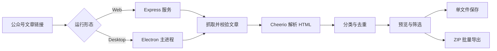

<div align="center">

# WeGet

从微信公众号文章中提取头图、卡片图、正文图片、视频、音频和附件。

[](https://nodejs.org/)
[](https://www.electronjs.org/)
[](#构建-windows-安装包)
[](#测试)
[](LICENSE)

[Web 版](#运行-web-版) · [桌面版](#运行桌面版) · [构建安装包](#构建-windows-安装包) · [安全设计](#安全设计) · [Star 趋势](#star-增长趋势) · [许可证](#许可证)

</div>

---

## 项目简介

WeGet 接收微信公众号文章链接，读取文章 HTML，识别其中的媒体资源并按类型归档。项目提供两个运行形态：

| 版本 | 适用场景 | 运行方式 | 导出方式 |
| --- | --- | --- | --- |
| Web | 本地开发、局域网使用、二次集成 | Node.js + Express | 单文件下载、ZIP 打包 |
| Desktop | 日常使用、无需单独启动服务 | Electron | 系统“另存为”、ZIP 导出 |

两个版本使用相同的解析策略。桌面版的抓取、预览代理和文件写入都在 Electron 主进程中完成，不监听本地端口。

## 功能

- 读取 `mp.weixin.qq.com` 和 `weixin.qq.com` 文章链接
- 提取文章头图、小程序卡片图、商品卡片图和正文图片
- 识别视频、视频封面、音频与常见附件链接
- 按资源类型筛选，支持单项保存与批量 ZIP 导出
- 微信 CDN 图片代理预览，保留原始资源地址和格式
- URL 白名单、资源签名、重定向检查和文件大小限制
- Web 与桌面界面均支持加载、空结果、错误和选中状态

> [!NOTE]
> 微信页面结构会调整，部分音视频只提供内部 ID，不一定包含可直接下载的媒体地址。图片、头图和卡片图通常更稳定。

## 工作流程



## 环境要求

| 依赖 | 要求 |
| --- | --- |
| Node.js | 20 或更高版本 |
| npm | 随 Node.js 安装，建议使用当前 LTS 自带版本 |
| Web 版系统 | Windows、macOS 或 Linux |
| 桌面版构建 | Windows 10/11 x64 |
| 网络 | 能访问微信公众号页面和腾讯 CDN |

检查本机环境：

```bash
node --version
npm --version
```

## 获取代码

```bash
git clone https://github.com/CaseyWon/WeGet.git
cd WeGet
```

仓库包含 `package-lock.json`。普通开发和 CI 建议使用 `npm ci`，保证依赖版本与锁文件一致。

## 运行 Web 版

安装依赖并启动：

```bash
npm ci
npm start
```

浏览器访问 <http://localhost:4173>。

开发时可启用 Node.js 文件监听：

```bash
npm run dev
```

修改端口（PowerShell）：

```powershell
$env:PORT = 4180
npm start
```

### Web 接口

| 方法 | 路径 | 用途 |
| --- | --- | --- |
| `POST` | `/api/parse` | 抓取文章并返回分类后的资源列表 |
| `GET` | `/api/resource` | 使用签名地址预览或下载单个资源 |
| `POST` | `/api/download` | 将选中资源打包为 ZIP |
| `GET` | `/api/health` | 服务健康检查 |

## 运行桌面版

桌面端有独立依赖和锁文件：

```bash
cd desktop
npm ci
npm start
```

首次安装依赖需要下载 Electron，所需时间取决于网络环境。桌面端详细说明见 [`desktop/README.md`](desktop/README.md)。

## 构建 Windows 安装包

以下命令在 `desktop/` 目录执行。

### 1. 构建未安装版

```bash
npm ci
npm run pack
```

输出位置：

```text
desktop/release-unpacked/win-unpacked/WeGet Desktop.exe
```

未安装版适合本机验收：直接运行 EXE，不写入开始菜单，也不创建卸载项。

### 2. 构建 NSIS 安装包

```bash
npm ci
npm run build:win
```

输出位置：

```text
desktop/release-installer/WeGet-Desktop-1.0.0-x64.exe
```

当前 NSIS 配置使用引导式安装：用户可以选择安装目录，安装器会创建桌面快捷方式和开始菜单快捷方式。

首次构建会下载 Electron Builder 所需的 NSIS 与 7-Zip 工具。请保持网络畅通，并确认 WeGet、Electron 和旧的安装包进程已经退出。

### 3. 代码签名

仓库没有内置证书。未签名安装包可能触发 Windows SmartScreen 提示；对外分发前应配置 Authenticode 签名。

electron-builder 可以从环境变量读取 Windows 证书。不要把 `.pfx` 文件或密码提交到仓库。

```powershell
$env:WIN_CSC_LINK = "C:\secure\company-codesign.pfx"
$env:WIN_CSC_KEY_PASSWORD = "证书密码"
npm run build:win
```

CI 中应把 `WIN_CSC_LINK` 和 `WIN_CSC_KEY_PASSWORD` 放入密钥管理服务。签名方式和证书要求以 [electron-builder Windows 代码签名文档](https://www.electron.build/docs/features/code-signing/code-signing-win/)为准。

## 测试

在项目根目录运行全部测试：

```bash
npm test
```

只运行桌面端测试：

```bash
cd desktop
npm test
```

当前测试覆盖：

- 文章元数据与资源类型解析
- 协议相对地址标准化与危险协议过滤
- 微信文章域名和腾讯资源域名白名单
- 下载签名校验与 Windows 文件名清理

提交前建议执行：

```bash
npm ci
npm test
cd desktop
npm ci
npm test
npm run pack
```

## 安全设计

### 网络边界

- 文章抓取仅接受微信文章域名
- 资源代理仅接受腾讯和微信资源域名
- 每次重定向都会重新校验目标域名
- 下载地址由进程内 HMAC 签名，服务重启后需重新解析
- 文章页面限制为 8 MB，单个资源限制为 50 MB，单次最多导出 100 项

### Electron 边界

- 渲染进程关闭 Node.js 集成
- 启用 `contextIsolation`、沙箱和 Web 安全策略
- preload 只暴露经过参数约束的解析、保存、剪贴板和打开原文方法
- IPC 校验调用页面来源
- 页面导航、新窗口和权限请求默认拒绝
- 本地页面和媒体预览使用独立的安全协议

## 目录结构

```text
WeGet/
├─ lib/
│  └─ parser.js               # Web 文章解析器
├─ public/
│  ├─ index.html              # Web 页面
│  ├─ app.js                  # Web 交互
│  └─ styles.css              # Web 样式
├─ test/
│  └─ parser.test.js          # Web 解析测试
├─ desktop/
│  ├─ src/
│  │  ├─ main.js              # Electron 主进程、协议与下载
│  │  ├─ preload.cjs          # 受限 IPC 桥接
│  │  ├─ parser.js            # 桌面文章解析器
│  │  ├─ security.js          # 域名、签名与文件名校验
│  │  └─ renderer/            # 桌面界面
│  ├─ test/                   # 桌面解析与安全测试
│  └─ package.json            # Electron Builder 配置
├─ server.js                  # Express 服务和下载代理
└─ package.json               # Web 脚本与依赖
```

## 故障排查

### 微信提示环境异常或访问频繁

微信可能根据访问频率和网络环境返回拦截页。稍后重试，避免短时间内连续解析大量文章；必要时更换网络。

### 图片可以识别但无法预览

确认电脑可以访问 `qpic.cn`、`qlogo.cn` 和 `gtimg.com`。公司代理、防火墙或 DNS 过滤可能拦截腾讯 CDN。

### Web 端口被占用

设置新的 `PORT` 后重新启动，示例见[运行 Web 版](#运行-web-版)。

### Electron 首次安装或构建下载缓慢

Electron、NSIS 和 7-Zip 会在首次安装或构建时下载。优先检查 npm 镜像、代理设置和 GitHub 下载连通性，不要中途终止进程。

### Windows 构建出现 `EPERM`、`unlink` 或 `rename`

这通常是 WeGet/Electron 进程、资源管理器预览或终端安全软件正在占用构建文件：

1. 关闭 WeGet、Electron 和打开了 `release-*` 目录的窗口。
2. 在任务管理器确认没有残留的 `WeGet Desktop.exe` 或 `electron.exe`。
3. 删除失败的 `release-unpacked` 或 `release-installer` 目录后重试。
4. 如果错误发生在 Electron Builder 缓存中，为项目目录和构建缓存配置可信规则，不要关闭系统防护。

需要使用项目内缓存时，可在 PowerShell 中执行：

```powershell
$env:ELECTRON_BUILDER_CACHE = "$PWD\.electron-builder-cache"
npm run build:win
```

## Star 增长趋势

<picture>
  <source media="(prefers-color-scheme: dark)" srcset="https://raw.githubusercontent.com/CaseyWon/WeGet/star-history/assets/star-history-dark.svg">
  
</picture>

图表由 GitHub Actions 每日自动更新，数据文件发布在独立的 `star-history` 分支。仓库暂无 Star 时显示占位状态，获得第一颗 Star 后会自动切换为真实增长曲线。

## 使用限制

- 仅下载和使用你有权处理的内容。
- 不要将该工具用于高频抓取、批量采集或绕过平台访问控制。
- 微信页面结构变化后，解析规则可能需要同步更新。

## 许可证

本项目基于 [MIT License](LICENSE) 开源。你可以使用、复制、修改和分发本项目，但必须保留原始版权声明和许可证文本。

## 相关文档

- [桌面端开发与构建](desktop/README.md)
- [Electron 安全建议](https://www.electronjs.org/docs/latest/tutorial/security)
- [electron-builder NSIS 配置](https://www.electron.build/docs/api/electron-builder.interface.nsisoptions/)
- [electron-builder Windows 代码签名](https://www.electron.build/docs/features/code-signing/code-signing-win/)
