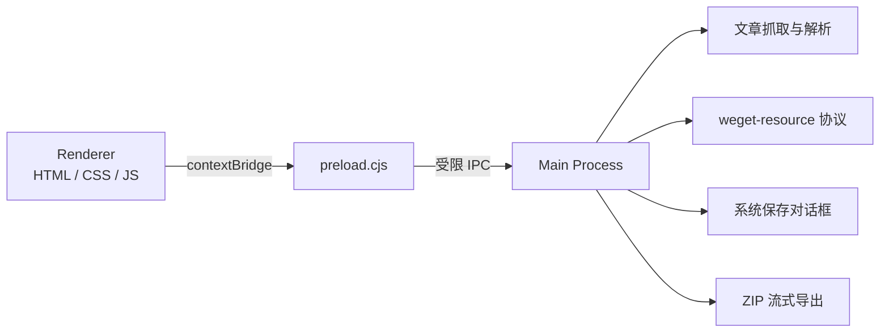

# WeGet Desktop

WeGet 的 Windows 桌面客户端。文章抓取、资源预览、文件保存和 ZIP 导出都由 Electron 主进程完成，不启动额外的 HTTP 服务。

返回[项目主页](../README.md)。

## 环境要求

| 项目 | 要求 |
| --- | --- |
| Node.js | 20 或更高版本 |
| npm | 使用 `package-lock.json` 对应版本 |
| 开发系统 | Windows 10/11 x64 |
| 安装器 | NSIS，由 electron-builder 自动下载 |

## 安装依赖

```bash
cd desktop
npm ci
```

`npm ci` 会严格按锁文件安装依赖，并下载 Electron。需要升级依赖时再使用 `npm install`。

## 开发运行

```bash
npm start
```

`npm run dev` 当前与 `npm start` 等价。修改渲染层或主进程代码后需要重启应用。

## 可用命令

| 命令 | 用途 | 输出 |
| --- | --- | --- |
| `npm start` | 启动桌面客户端 | Electron 窗口 |
| `npm test` | 运行解析与安全测试 | 终端测试报告 |
| `npm run pack` | 构建未安装版 | `release-unpacked/win-unpacked/` |
| `npm run build:win` | 构建 x64 NSIS 安装器 | `release-installer/*.exe` |

## 构建未安装版

```bash
npm run pack
```

主程序：

```text
release-unpacked/win-unpacked/WeGet Desktop.exe
```

该目录包含 Chromium、Node.js 运行时和应用资源，必须整体复制。不要只分发其中的 EXE。

## 构建 Windows 安装包

```bash
npm run build:win
```

默认产物：

```text
release-installer/WeGet-Desktop-1.0.0-x64.exe
```

版本号取自 `desktop/package.json`。发布新版本前，同时更新 `package.json` 与 `package-lock.json`：

```bash
npm version patch --no-git-tag-version
npm test
npm run build:win
```

安装器配置：

- x64 NSIS 安装包
- 引导式安装，不是一键静默安装
- 允许用户选择安装目录
- 创建桌面和开始菜单快捷方式
- 默认按当前用户安装，不要求全局安装

## 代码签名

本地构建默认没有正式发布证书。向外部分发时，建议通过 CI 密钥注入签名材料：

```powershell
$env:WIN_CSC_LINK = "C:\secure\company-codesign.pfx"
$env:WIN_CSC_KEY_PASSWORD = "证书密码"
npm run build:win
```

`WIN_CSC_LINK` 也可以是 HTTPS 地址或 Base64 编码的证书。证书和密码不能写入 `package.json`、脚本或提交记录。详见 [electron-builder 代码签名文档](https://www.electron.build/docs/features/code-signing/code-signing-win/)。

## 进程结构



### 主进程

`src/main.js` 负责窗口生命周期、自定义协议、文章抓取、资源下载、文件对话框和 ZIP 导出。

### preload

`src/preload.cjs` 使用 `contextBridge` 暴露有限方法。渲染层拿不到 Node.js、文件系统或任意 IPC 权限。

### 渲染层

`src/renderer/` 只处理界面和交互，通过 `window.wegetDesktop` 请求主进程能力。

## 安全约束

- `nodeIntegration: false`
- `contextIsolation: true`
- `sandbox: true`
- CSP 限制脚本、图片、连接和 frame 来源
- IPC 校验 `senderFrame` 来源
- 仅允许微信文章和腾讯资源域名
- 禁止页面导航、新窗口和权限申请
- 资源下载需要进程内 HMAC 签名
- 单文件最大 50 MB，单次最多导出 100 项

## 测试

```bash
npm test
```

测试覆盖文章分类、危险域名过滤、资源签名和 Windows 文件名清理。

## 构建排查

### `EPERM: operation not permitted`

先关闭正在运行的 WeGet 和 Electron 进程，也不要在资源管理器中预览 `release-*` 目录。确认进程退出后，删除失败的输出目录再重试。

如果 Electron Builder 的全局缓存被终端安全软件持续占用，可以改用项目内缓存：

```powershell
$env:ELECTRON_BUILDER_CACHE = "$PWD\.electron-builder-cache"
npm run build:win
```

不要为解决构建问题关闭系统防护。受管理的公司电脑应由管理员为可信项目目录和构建缓存配置规则。

### 安装包触发 SmartScreen

未签名或刚签发的证书可能触发 SmartScreen。正式分发时使用受信任的代码签名证书，并保持发布者名称一致。

### 首次构建停在下载阶段

Electron Builder 首次构建需要下载 NSIS 和 7-Zip。检查网络、代理和 GitHub 下载连通性，然后重新执行构建命令。
